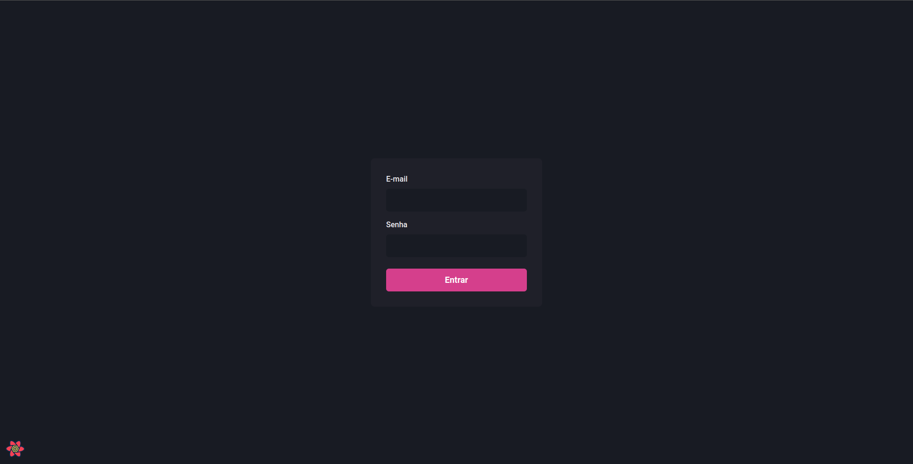
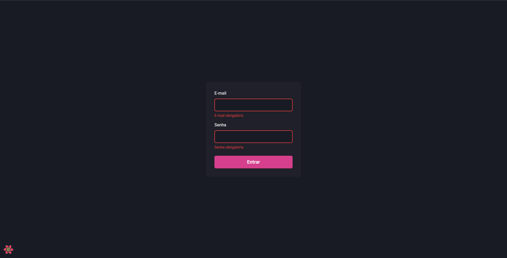
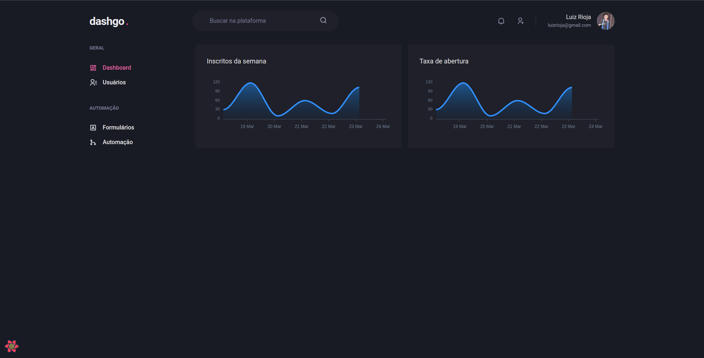
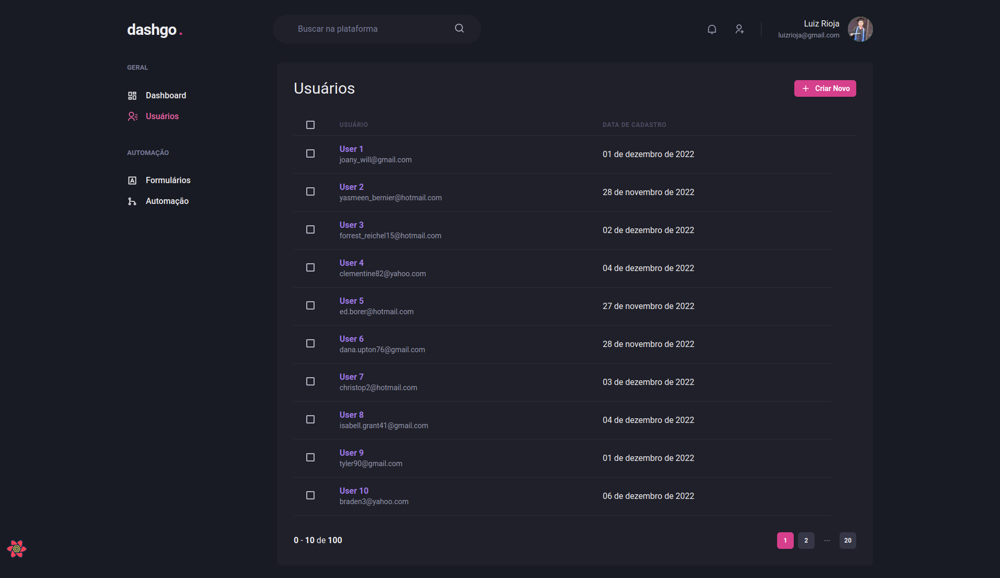
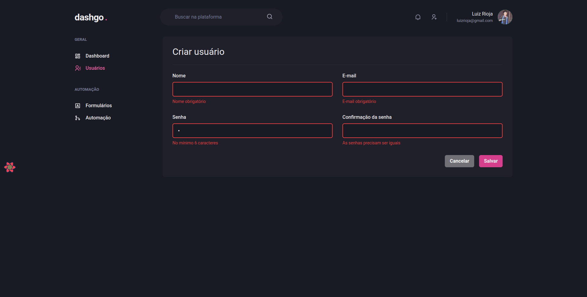

# DashGO

<p align="center">
  
  
  
  
</p>
<br>

<p align="center">
  <a href="#sobre">Sobre</a> •
  <a href="#dashgo-1">DashGO</a> •
  <a href="#instalação">Instalação</a> •
  <a href="#tecnologias">Tecnologias</a> •
  <a href="#autor">Autor</a>  
</p>

<br>

## Sobre

Projeto desenvolvido durante o bootcamp Ignite de React da RocketSeat cujo objetivo foi construir uma interface moderna, utilizando tecnologias atuais e em alta no mercado e, claro, seguindo as melhores praticas do desenvolvimento frontend. O projeto foi desenvolvido utilizando NextJS e ChakraUI, além de diversas outras bibliotecas modernas. A aplicação é um dashboard de administração e será apresentada em detalhes no proximo tópico.

## DashGO

O DashGO é um painel web administrativo que permite o gerenciamento de usuários, formulários e automações. Para realizar o gerenciamento, os usuários devem realizar o login através da tela abaixo para que suas permissões e identidade sejam validados e o acesso seja concedido:



O formulário de login, assim como os demais formulários da aplicação, possuem validações em todos os campos e, havendo algum problema, mensagens de erros serão adicionadas abaixo dos campos para deixar explicito para os usuários que o dado inserido está incorreto e por que, conforme vemos abaixo:



Após realizar o login o usuário será direcionado para a tela de dashboard, aonde poderá acompanhar alguns indicadores e terá acesso rápido à um menu lateral contendo opções para gerenciar usuários, formulários e automações:



Das opções presentes no menu lateral apenas a tela de usuários foi implementada pois trata-se de um projeto fictício com finalidade estudantil. Dada essa observação, vamos conhecer o painel de gerenciamento de usuários:



Como podemos ver acima, ao acessar a página teremos uma tabela que listará todos os usuários cadastrados na aplicação. Nessa tela o usuário pode navegar pelos registros dos usuários através dos botões de paginação, pode visualizar o cadastro de um usuário e pode cadastrar um novo usuário ao clicar no botão no canto superior direito.

Ao clicar no botão de cadastro o usuário será direcionado para o formulário abaixo para inserir os dados do novo usuário e, não havendo nenhuma irregularidade como abaixo, salva-lo no banco de dados:



## Instalação

Antes de começar, você vai precisar ter instalado em sua máquina as seguintes ferramentas:
[Git](https://git-scm.com), [Node.js](https://nodejs.org/en/).
Além disto é bom ter um editor para trabalhar com o código como [VSCode](https://code.visualstudio.com/).

### 🖥️ Rodando o Front End (Web)

```bash
# Clone este repositório
$ git clone git@github.com:MrRioja/dashgo.git

# Acesse a pasta do projeto no terminal/cmd
$ cd dashgo

# Instale as dependências
$ npm install
# Caso prefira usar o Yarn execute o comando abaixo
$ yarn

# Execute a aplicação em modo de desenvolvimento
$ npm run dev
# Caso prefira usar o Yarn execute o comando abaixo
$ yarn dev

# O servidor inciará na porta 3000 - acesse <http://localhost:3000>
```

## Tecnologias


<br><br><br><br>

## Autor

<div align="center">

<h1>Luiz Rioja</h1>
<strong>Backend Developer</strong>
<br/>
<br/>

<a href="https://linkedin.com/in/luizrioja" target="_blank">

</a>

<a href="https://github.com/mrrioja" target="_blank">

</a>

<a href="mailto:lulyrioja@gmail.com?subject=Fala%20Dev" target="_blank">

</a>

<a href="https://api.whatsapp.com/send?phone=5511933572652" target="_blank">

</a>

<a href="https://join.skype.com/invite/tvBbOq03j5Uu" target="_blank">

</a>

<br/>
<br/>
</div>
